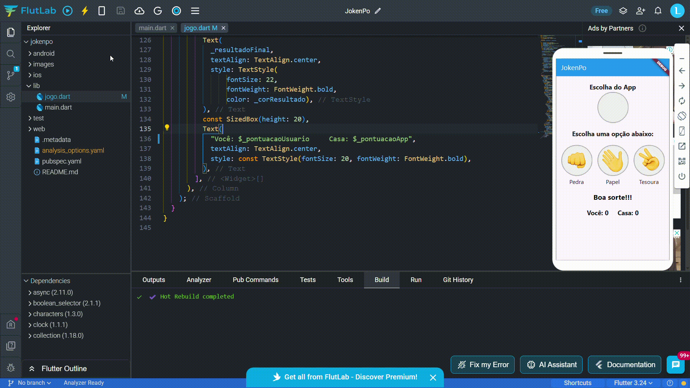

# JokenPo - Flutter App

Um aplicativo de JokenPo (Pedra, Papel e Tesoura) desenvolvido em Flutter. O usuário pode escolher entre Pedra, Papel ou Tesoura, enquanto o app faz uma escolha aleatória e exibe o resultado da partida, incluindo a pontuação do jogador e do aplicativo.

## 🎥 Demonstração



## 📦 Funcionalidades

- Escolha entre Pedra, Papel ou Tesoura.
- O app gera uma escolha aleatória.
- Mostra o resultado da partida.
- Exibe pontuação do jogador e do app.

## 🛠 Tecnologias Utilizadas

- Flutter
- Dart

## 🚀 Como Executar o Projeto

### Pré-requisitos

- [Flutter](https://flutter.dev/docs/get-started/install) instalado.

### Passos para rodar o app

1. Clone este repositório:

   ```sh
   git clone https://github.com/LucasHapr/app_jokenpo
   ```

2. Acesse a pasta do projeto:

   ```sh
   cd jokenpo-flutter
   ```

3. Instale as dependências:

   ```sh
   flutter pub get
   ```

4. Execute o app:

   ```sh
   flutter run
   ```
